<div align="center">

# SurplusEats

Prototype aplikasi web untuk food rescue, pembelian makanan surplus, dashboard owner restoran, dan dashboard admin operasional.

Web application prototype for food rescue, surplus food ordering, restaurant owner operations, and admin management.


**Status: Work in Progress / Masih Dalam Tahap Pengerjaan**

[Bahasa Indonesia](#bahasa-indonesia) · [English](#english) · [Screenshots](#screenshots) · [Credit](#credit--ownership)

</div>

---

## Screenshots

Screenshot files are stored in [`public/screenshots`](public/screenshots).

### Customer App

| Login | Home | Cart |
| --- | --- | --- |
| 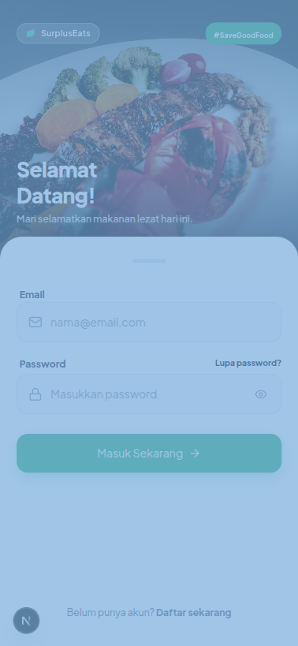 | 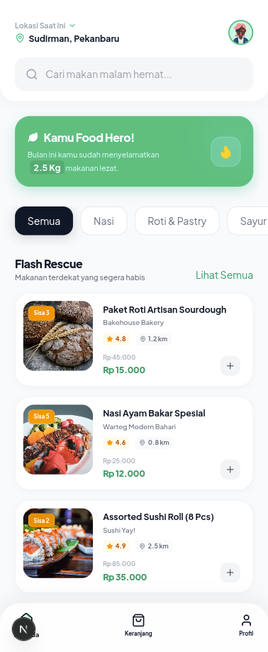 | 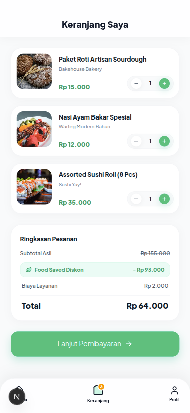 |

| Checkout | Tracking | Profile |
| --- | --- | --- |
| 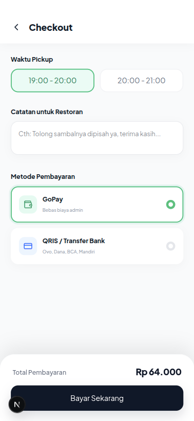 | 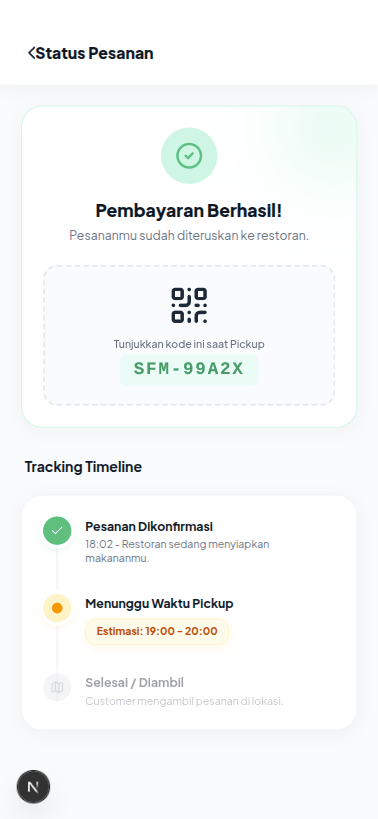 | 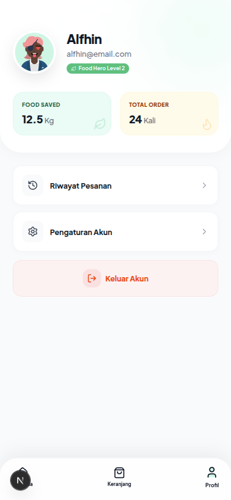 |

| Order History | Review Modal |
| --- | --- |
| 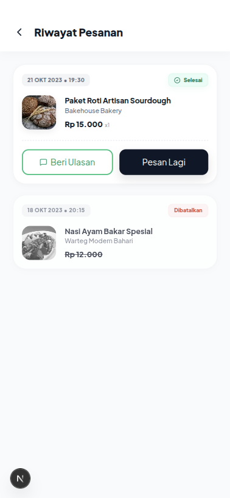 | 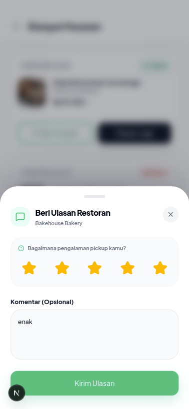 |

### Owner Dashboard

| Dashboard | Orders / Menu Management |
| --- | --- |
| 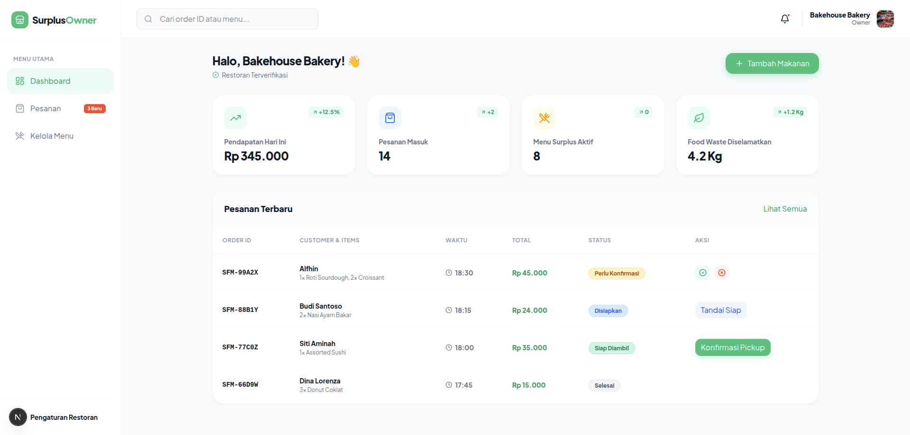 | 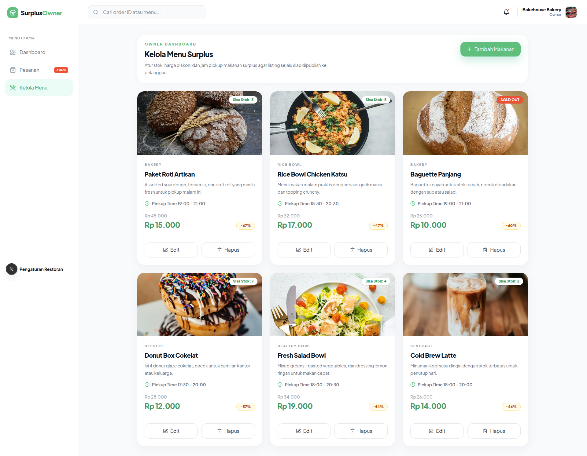 |

| Notifications | Settings |
| --- | --- |
| 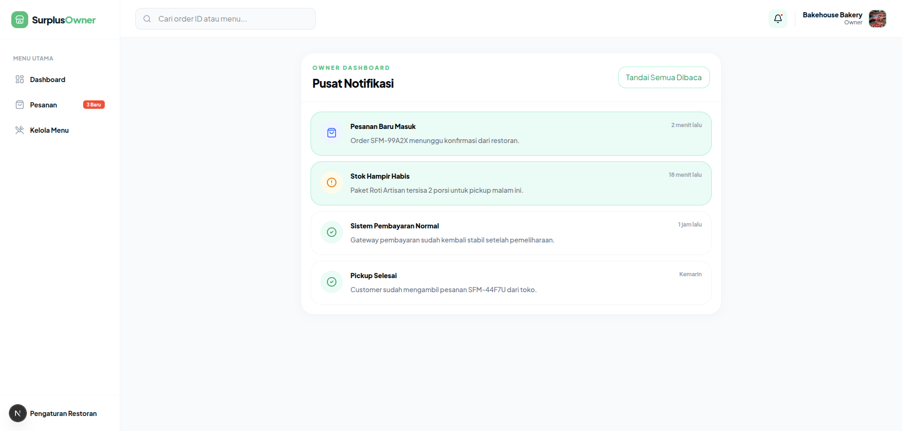 | 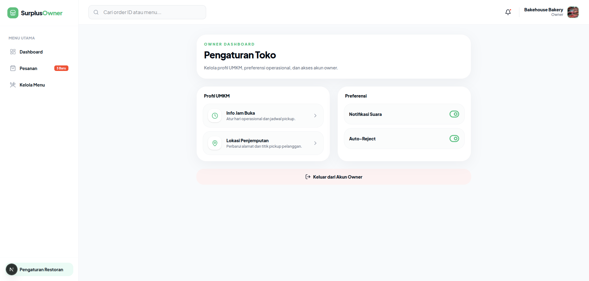 |

### Admin Dashboard

| Admin Overview | User Management |
| --- | --- |
| 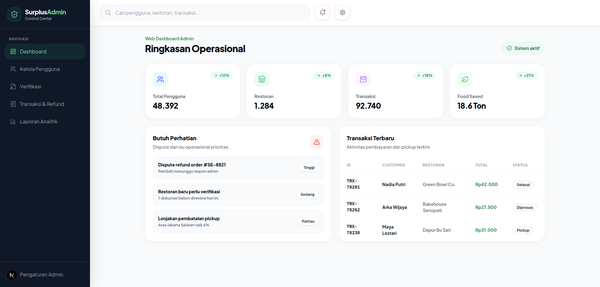 | 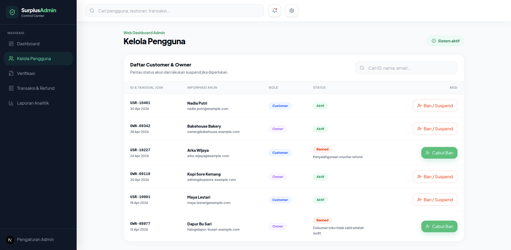 |

| Verification | Transaction / Refund |
| --- | --- |
| 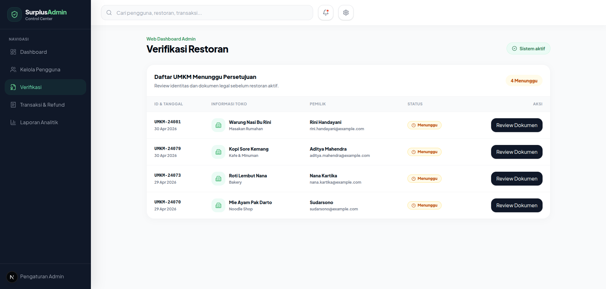 | 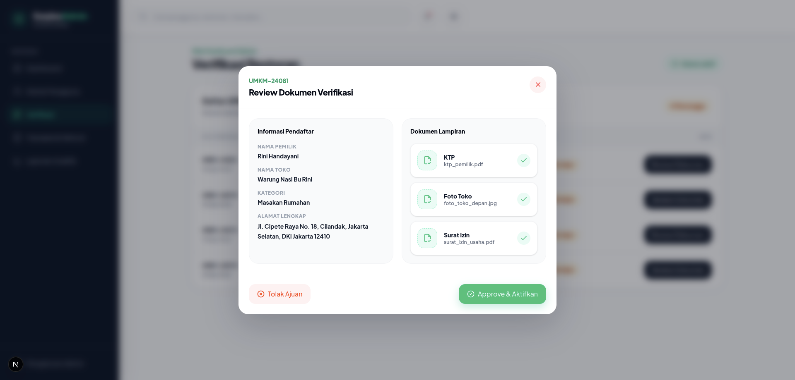 |

| Analytics | Additional Admin Screen |
| --- | --- |
| 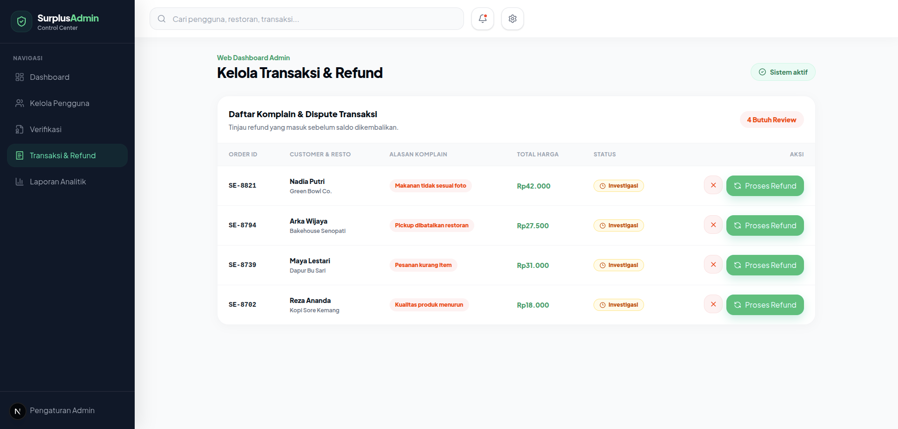 | 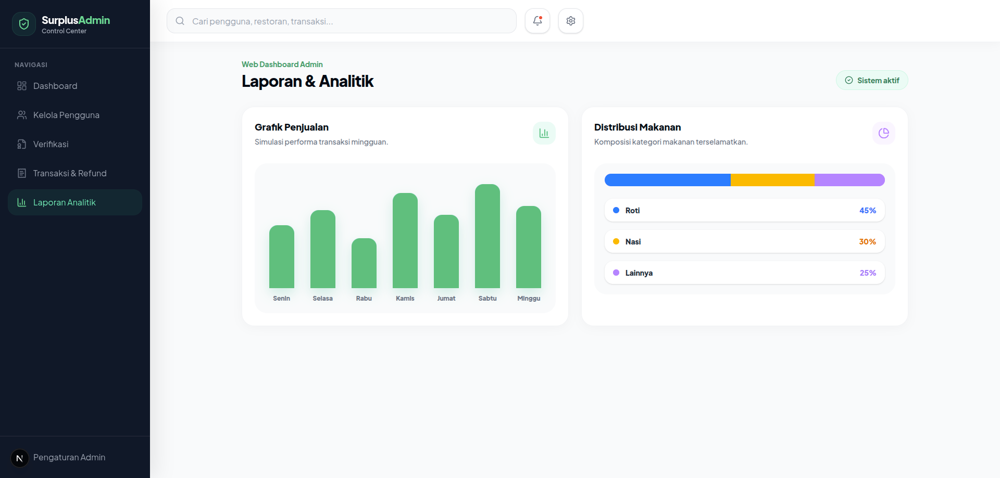 |

---

## Bahasa Indonesia

### Tentang Project

SurplusEats adalah prototype aplikasi web untuk membantu pelanggan membeli makanan surplus dari restoran atau UMKM dengan harga lebih hemat. Di sisi lain, owner restoran dapat mengelola menu surplus, pesanan, stok, dan pengaturan toko. Admin dapat mengelola pengguna, verifikasi restoran, transaksi, refund, dan laporan analitik.

Project ini masih berada pada tahap frontend prototype. Banyak data masih memakai mock data dan state lokal. Backend, database, autentikasi produksi, dan payment gateway belum diimplementasikan.

### Status Development

Project ini **masih dalam tahap pengerjaan**.

Yang belum final:

- Belum memakai database PostgreSQL.
- Belum ada backend API.
- Belum ada autentikasi produksi.
- Belum ada payment gateway asli.
- Belum ada upload file produksi.
- Belum ada role-based access control yang sebenarnya.
- Data masih menggunakan mock data.
- State sebagian besar masih berada di komponen React.

### Fitur Utama

#### Customer App

- Login dan register customer.
- Home makanan surplus.
- Browse / pencarian makanan.
- Detail makanan.
- Cart / keranjang.
- Checkout.
- Payment success dan payment failed screen.
- Tracking pesanan.
- Riwayat pesanan.
- Modal ulasan restoran dengan star rating.
- Profile customer.

#### Owner Dashboard

- Dashboard owner desktop.
- Kanban manajemen pesanan.
- Kelola menu surplus.
- Tambah makanan.
- Edit makanan dengan data pre-filled.
- Hapus makanan dengan modal konfirmasi.
- Pendaftaran mitra/toko.
- Menunggu verifikasi.
- Akun dibekukan / banned.
- Notifikasi owner.
- Pengaturan toko.

#### Admin Dashboard

- Sidebar admin dark mode.
- Statistik operasional.
- Kelola pengguna.
- Ban / suspend user.
- Verifikasi restoran / UMKM.
- Modal review dokumen.
- Kelola transaksi dan refund.
- Laporan analitik.

### Tech Stack

- Next.js 16
- React 19
- TypeScript
- Tailwind CSS 4
- lucide-react

### Cara Menjalankan

Install dependency:

```bash
npm install
```

Jalankan development server:

```bash
npm run dev
```

Buka di browser:

```text
http://localhost:3000
```

### Script

| Command | Fungsi |
| --- | --- |
| `npm run dev` | Menjalankan development server |
| `npm run build` | Membuat production build |
| `npm run start` | Menjalankan production server |
| `npm run lint` | Menjalankan ESLint |

### Route Customer

| Route | Deskripsi |
| --- | --- |
| `/` | Login customer |
| `/register` | Register customer |
| `/home` | Home customer |
| `/browse` | Browse / hasil pencarian |
| `/detail/[id]` | Detail makanan |
| `/cart` | Keranjang |
| `/checkout` | Checkout |
| `/payment-failed` | Pembayaran gagal |
| `/tracking` | Tracking pesanan |
| `/history` | Riwayat pesanan dan ulasan |
| `/profile` | Profile customer |

### Route Owner

| Route | Deskripsi |
| --- | --- |
| `/register-mitra` | Form pendaftaran mitra |
| `/owner/dashboard` | Dashboard owner |
| `/owner/menu` | Kelola menu |
| `/owner/notifications` | Notifikasi owner |
| `/owner/settings` | Pengaturan toko |
| `/owner/verify` | Menunggu verifikasi |
| `/owner/banned` | Akun owner dibekukan |

### Route Admin

| Route | Deskripsi |
| --- | --- |
| `/admin/dashboard` | Dashboard admin |

### Struktur Folder

```text
app/
  admin/
  owner/
  browse/
  cart/
  checkout/
  detail/
  history/
  home/
  payment-failed/
  profile/
  register/
  register-mitra/
  tracking/

components/
  customer-*.tsx
  owner-menu-management.tsx
  main-shell.tsx
  mobile-device-frame.tsx

lib/
  customer-data.ts

public/
  screenshots/
```

### Rencana Lanjutan

1. Membuat skema database PostgreSQL.
2. Membuat backend API.
3. Menambahkan autentikasi.
4. Menghubungkan UI ke database.
5. Menambahkan validasi form produksi.
6. Menambahkan payment gateway.
7. Menambahkan upload file produksi.
8. Menambahkan testing.
9. Menentukan license resmi sebelum project dipublikasikan lebih luas.

---

## English

### About The Project

SurplusEats is a web application prototype for helping customers buy surplus food from restaurants or small businesses at a more affordable price. Restaurant owners can manage surplus menus, orders, stock, and store settings. Admins can manage users, restaurant verification, transactions, refunds, and analytics.

This project is currently a frontend prototype. Most data is still mocked and stored in local React state. Backend services, database integration, production authentication, and real payment gateway integration are not implemented yet.

### Development Status

This project is **still in progress**.

Not final yet:

- No PostgreSQL database integration yet.
- No backend API yet.
- No production authentication yet.
- No real payment gateway yet.
- No production file upload yet.
- No real role-based access control yet.
- Data is still mocked.
- Most state is still local to React components.

### Main Features

#### Customer App

- Customer login and registration.
- Surplus food home screen.
- Food browse / search page.
- Food detail page.
- Cart.
- Checkout.
- Payment success and payment failed screens.
- Order tracking.
- Order history.
- Restaurant review modal with star rating.
- Customer profile.

#### Owner Dashboard

- Desktop owner dashboard.
- Kanban order management.
- Surplus menu management.
- Add food modal.
- Edit food modal with pre-filled data.
- Delete food confirmation modal.
- Partner / store registration.
- Waiting for verification page.
- Banned owner account page.
- Owner notifications.
- Store settings.

#### Admin Dashboard

- Dark admin sidebar.
- Operational statistics.
- User management.
- Ban / suspend user flow.
- Restaurant / UMKM verification.
- Document review modal.
- Transaction and refund management.
- Analytics report simulation.

### Tech Stack

- Next.js 16
- React 19
- TypeScript
- Tailwind CSS 4
- lucide-react

### Getting Started

Install dependencies:

```bash
npm install
```

Run the development server:

```bash
npm run dev
```

Open in browser:

```text
http://localhost:3000
```

### Available Scripts

| Command | Description |
| --- | --- |
| `npm run dev` | Start the development server |
| `npm run build` | Build for production |
| `npm run start` | Start the production server |
| `npm run lint` | Run ESLint |

### Customer Routes

| Route | Description |
| --- | --- |
| `/` | Customer login |
| `/register` | Customer registration |
| `/home` | Customer home |
| `/browse` | Browse / search result |
| `/detail/[id]` | Food detail |
| `/cart` | Cart |
| `/checkout` | Checkout |
| `/payment-failed` | Payment failed |
| `/tracking` | Order tracking |
| `/history` | Order history and review |
| `/profile` | Customer profile |

### Owner Routes

| Route | Description |
| --- | --- |
| `/register-mitra` | Partner / store registration form |
| `/owner/dashboard` | Owner dashboard |
| `/owner/menu` | Menu management |
| `/owner/notifications` | Owner notifications |
| `/owner/settings` | Store settings |
| `/owner/verify` | Waiting for verification |
| `/owner/banned` | Banned owner account |

### Admin Routes

| Route | Description |
| --- | --- |
| `/admin/dashboard` | Admin dashboard |

### Project Structure

```text
app/
  admin/
  owner/
  browse/
  cart/
  checkout/
  detail/
  history/
  home/
  payment-failed/
  profile/
  register/
  register-mitra/
  tracking/

components/
  customer-*.tsx
  owner-menu-management.tsx
  main-shell.tsx
  mobile-device-frame.tsx

lib/
  customer-data.ts

public/
  screenshots/
```

### Next Steps

1. Design the PostgreSQL database schema.
2. Build the backend API.
3. Add authentication.
4. Connect the UI to the database.
5. Add production-grade form validation.
6. Add payment gateway integration.
7. Add production file upload support.
8. Add tests.
9. Define an official license before broader publication.

---

## Credit & Ownership

Created and developed by:

**Fhynn**  
GitHub: [@Fhynn](https://github.com/Fhynn)

The project name **SurplusEats**, UI structure, product flow, and author identity in this README must not be removed, renamed, or claimed as someone else's work without permission from the project owner.

Copyright (c) 2026 **Fhynn**. All rights reserved.

This project has not been released under a public open-source license yet. If you want to use, modify, republish, or use this project as a base for another product, you must credit **Fhynn** and request permission first.

## Notice

Do not remove the author credit, rename the project, or claim this project as your own work. A formal `LICENSE` file should be added later before public distribution or collaboration.
